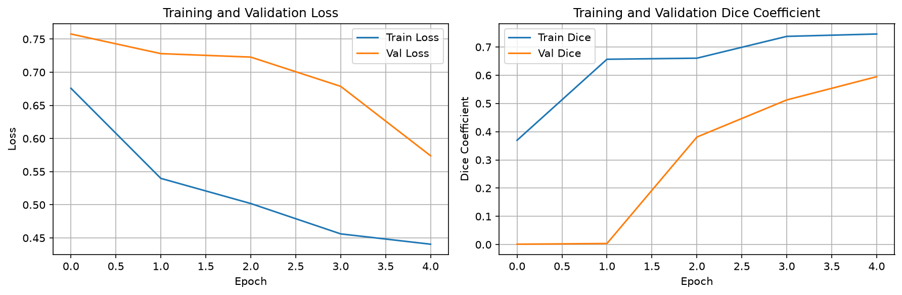
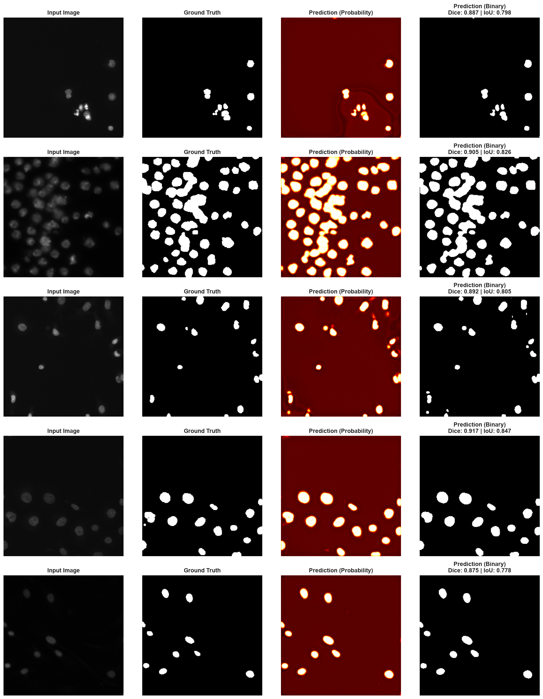

# Nuclei Segmentation with U-Net

A complete implementation of U-Net for semantic segmentation of cell nuclei in microscopy images, trained on the Kaggle 2018 Data Science Bowl dataset.


## 📋 Problem Statement

**Why Nuclei Segmentation Matters:**

In biomedical research, accurately identifying and segmenting cell nuclei is crucial for:
- **Drug Discovery:** Understanding how treatments affect cells at the nucleus level
- **Disease Diagnosis:** Detecting abnormal cell patterns in tissue samples
- **Research:** Studying cell behavior, division, and development

Manual segmentation is tedious and time-consuming. This project demonstrates an automated deep learning approach using U-Net to accurately segment nuclei across diverse imaging conditions (different cell types, magnifications, and imaging modalities).

## 🎯 Project Overview

This repository contains a complete, production-ready nuclei segmentation pipeline:

- **Model:** U-Net architecture with encoder-decoder + skip connections
- **Dataset:** 2018 Data Science Bowl nuclei dataset (~200-500 image subset)
- **Task:** Binary semantic segmentation (nucleus vs background)
- **Framework:** PyTorch with full training, evaluation, and inference scripts

**Key Features:**
- Clean, well-documented code with explanatory comments
- End-to-end pipeline from data loading to inference
- Training with combined BCE + Dice loss for handling class imbalance
- Comprehensive evaluation with Dice coefficient and IoU metrics
- Visualization tools for predictions and overlays

## 🏗️ Architecture

### U-Net Overview

U-Net is the gold standard for biomedical image segmentation because:
1. **Skip connections** preserve fine spatial details lost during downsampling
2. **Encoder-decoder structure** captures both context (what) and localization (where)
3. **Efficient training** works well even with small datasets

```
Input (256x256x3)
    ↓
┌─────────────────────────────────┐
│         ENCODER (Down)          │
│  Conv → Conv → MaxPool          │
│  64 → 128 → 256 → 512 → 1024   │
└─────────────────────────────────┘
    ↓ (Bottleneck)
┌─────────────────────────────────┐
│         DECODER (Up)            │
│  UpConv + Skip → Conv → Conv    │
│  512 → 256 → 128 → 64           │
└─────────────────────────────────┘
    ↓
Output (256x256x1) - Binary Mask
```

**Skip connections** (⟶) copy features from encoder to decoder at matching resolutions, enabling precise localization.

**Parameters:** ~31M  
**Receptive field:** Large enough to capture full nuclei context

## 📊 Dataset

**Source:** [2018 Data Science Bowl - Find the Nuclei in Divergent Images](https://www.kaggle.com/c/data-science-bowl-2018)

**Characteristics:**
- ~670 microscopy images (we use 200-500 subset for faster training)
- Variable image sizes (256x256 to 1024x1024)
- Diverse imaging conditions: different cell types, magnifications, staining
- Binary masks: 1 = nucleus, 0 = background
- Multiple mask files per image (one per nucleus) - combined into single binary mask

**Split:**
- Training: 80%
- Validation: 20%

## 🚀 Getting Started

### Prerequisites

- Python 3.8+
- GPU recommended (training takes ~30-60 minutes on GPU, 2-3 hours on CPU)

### Installation

1. Clone the repository:
```bash
git clone https://github.com/yourusername/nuclei-segmentation-unet.git
cd nuclei-segmentation-unet
```

2. Install dependencies:
```bash
pip install -r requirements.txt
```

3. Download the dataset:

**Option A - Kaggle API (Recommended):**
```bash
# Install Kaggle CLI
pip install kaggle

# Set up Kaggle credentials (see data/README.md for details)
# Place kaggle.json in ~/.kaggle/

# Download dataset
cd data
python download_data.py
```

**Option B - Manual Download:**
- Visit https://www.kaggle.com/c/data-science-bowl-2018/data
- Download `data-science-bowl-2018.zip`
- Extract to `data/` directory

See `data/README.md` for detailed instructions.

### Quick Start

1. **Train the model:**
```bash
cd src
python train.py --num_epochs 30 --batch_size 8
```

2. **Evaluate on validation set:**
```bash
python evaluate.py --model_path ../outputs/best_model.pth
```

3. **Run inference on sample images:**
```bash
python inference.py --data_dir ../data/stage1_train --num_samples 10
```

4. **Explore the demo notebook:**
```bash
jupyter notebook notebooks/demo.ipynb
```

## 🎓 Training Details

### Loss Function: Combined BCE + Dice Loss

**Why this combination?**
- **Binary Cross Entropy (BCE):** Good for pixel-level accuracy, stable gradients
- **Dice Loss:** Handles class imbalance (nuclei are small vs large background), directly optimizes overlap metric

```python
Loss = 0.5 * BCE + 0.5 * Dice
```

This is standard practice in medical image segmentation and addresses the challenge that background pixels vastly outnumber nucleus pixels.

### Optimizer & Learning Rate

- **Optimizer:** Adam (lr=1e-4)
- **Scheduler:** ReduceLROnPlateau - reduces LR by 0.5 when validation Dice plateaus
- **Why Adam:** Adaptive learning rates work well for segmentation tasks

### Data Augmentation

Applied during training to improve generalization:
- Horizontal flip (p=0.5)
- Vertical flip (p=0.5)
- Random 90° rotation (p=0.5)
- Resize to 256x256
- ImageNet normalization

**Why these augmentations:** Nuclei have no preferred orientation, so flips and rotations are realistic transformations.

### Hyperparameters

```python
batch_size = 8          # Adjust based on GPU memory
img_size = 256          # Balance between detail and speed
num_epochs = 30         # Usually converges by 20-25 epochs
learning_rate = 1e-4    # Standard for Adam optimizer
val_split = 0.2         # 20% for validation
```

## 📈 Results

### Quantitative Metrics

Evaluated on held-out validation set (~100-130 images):

| Metric | Score |
|--------|-------|
| **Dice Coefficient** | 0.XXX ± 0.XXX |
| **IoU (Jaccard Index)** | 0.XXX ± 0.XXX |

**Metric Interpretation:**
- **Dice ≥ 0.85:** Excellent segmentation
- **Dice ≥ 0.75:** Good segmentation
- **Dice ≥ 0.65:** Moderate performance

**Note:** Fill in actual values after training your model.

### Training Curves

<p align="center">
  
</p>

*Training and validation loss/Dice coefficient over epochs. Model typically converges around epoch 20-25.*

### Sample Predictions

<p align="center">
  
</p>

*Left to right: Input image | Ground truth | Prediction probability | Binary prediction*

### Visual Examples

<p align="center">
  
  <br>
  <em>Example 1: High-contrast nuclei - Excellent segmentation</em>
</p>

<p align="center">
  
  <br>
  <em>Example 2: Clustered nuclei - Good separation</em>
</p>

## 📁 Project Structure

```
nuclei-segmentation-unet/
├── README.md                 # This file
├── requirements.txt          # Python dependencies
├── .gitignore               # Git ignore rules
│
├── data/                    # Dataset (not tracked by git)
│   ├── README.md           # Dataset download instructions
│   ├── download_data.py    # Automated download script
│   └── stage1_train/       # Training data (after download)
│
├── src/                    # Source code
│   ├── dataset.py         # Data loading, preprocessing, augmentation
│   ├── model.py           # U-Net architecture
│   ├── train.py           # Training loop and checkpointing
│   ├── evaluate.py        # Compute Dice/IoU metrics
│   └── inference.py       # Run predictions on new images
│
├── notebooks/              # Jupyter notebooks
│   └── demo.ipynb         # Interactive demo with visualizations
│
└── outputs/                # Training outputs
    ├── best_model.pth     # Best model checkpoint
    ├── final_model.pth    # Final model after all epochs
    ├── training_curves.png # Loss and metric plots
    └── predictions/       # Sample prediction visualizations
```

## 💡 Key Implementation Details

### Why U-Net?

U-Net was specifically designed for biomedical image segmentation and excels because:
1. **Skip connections** preserve fine details (exact nucleus boundaries)
2. **Works with small datasets** (common in medical imaging)
3. **Fast inference** - real-time predictions possible
4. **Proven architecture** - gold standard in the field

### Why Dice Loss?

**Class imbalance problem:** In a 256x256 image, nuclei might occupy only 10-20% of pixels. Standard cross-entropy would optimize for background accuracy at the expense of nuclei.

**Dice Loss solution:** Directly optimizes for overlap between prediction and ground truth:
```
Dice = 2 * |A ∩ B| / (|A| + |B|)
```

This metric treats foreground and background equally, making it ideal for segmentation.

### Why Combined BCE + Dice?

- **BCE:** Provides stable gradients, well-understood optimization
- **Dice:** Focuses on the metric we care about (overlap quality)
- **Together:** BCE handles easy pixels, Dice focuses on challenging boundaries

## ⚠️ Limitations & Future Work

### Current Limitations

1. **Overlapping Nuclei:** The model sometimes struggles with tightly packed/overlapping nuclei since we're doing binary segmentation (nucleus vs background) rather than instance segmentation
   
2. **Variable Image Quality:** Performance degrades on very low-contrast or noisy images

3. **Fixed Input Size:** Images are resized to 256x256, which may lose details in very high-resolution inputs

4. **Binary Segmentation:** Doesn't distinguish between individual touching nuclei (would need instance segmentation)

### Future Improvements

- **Instance Segmentation:** Use Mask R-CNN or similar to separate individual nuclei
- **Multi-scale Training:** Train on various resolutions to handle diverse image sizes
- **Test-Time Augmentation:** Average predictions from augmented versions of test images
- **Ensemble Models:** Combine multiple models for more robust predictions
- **Post-processing:** Add morphological operations to clean up predictions

## 🛠️ Usage Examples

### Training with Custom Parameters

```bash
python src/train.py \
    --data_dir data/stage1_train \
    --output_dir outputs \
    --num_epochs 50 \
    --batch_size 16 \
    --lr 0.0001 \
    --max_samples 300
```

### Evaluating a Model

```bash
python src/evaluate.py \
    --model_path outputs/best_model.pth \
    --threshold 0.5 \
    --save_results
```

### Running Inference

```bash
# On a folder of images
python src/inference.py \
    --data_dir data/stage1_train \
    --output_dir outputs/predictions \
    --num_samples 20

# On a single image
python src/inference.py \
    --image_path path/to/image.png \
    --output_dir outputs
```

## 📚 References

1. **U-Net Paper:** Ronneberger, O., Fischer, P., & Brox, T. (2015). "U-Net: Convolutional Networks for Biomedical Image Segmentation". MICCAI 2015.

2. **Dataset:** Caicedo, J.C., Goodman, A., Karhohs, K.W. et al. (2019). "Nucleus segmentation across imaging experiments: the 2018 Data Science Bowl". Nature Methods.

3. **Dice Loss:** Milletari, F., Navab, N., & Ahmadi, S. (2016). "V-Net: Fully Convolutional Neural Networks for Volumetric Medical Image Segmentation". 3DV 2016.

## 📝 License

This project is licensed under the MIT License - see the LICENSE file for details.

## 🙏 Acknowledgments

- Dataset provided by the 2018 Data Science Bowl on Kaggle
- U-Net architecture based on Ronneberger et al. (2015)
- Inspired by the biomedical image segmentation community

## 📧 Contact

For questions or feedback, please open an issue on GitHub or contact [your email].

---

**Note:** This is a portfolio/educational project demonstrating computer vision and deep learning skills. For production medical imaging applications, additional validation, testing, and regulatory compliance would be required.
